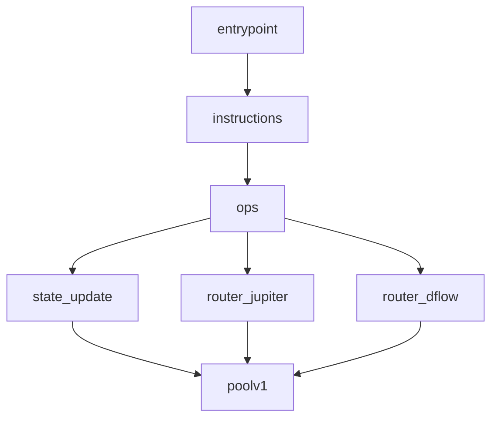
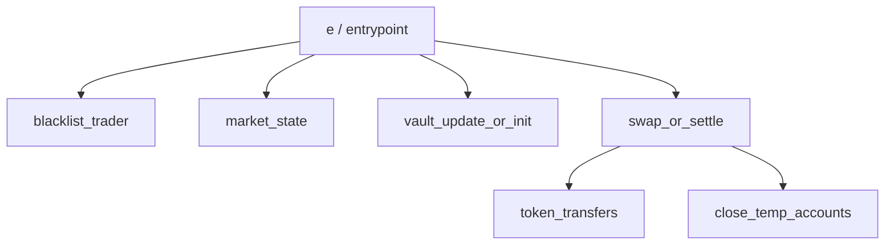
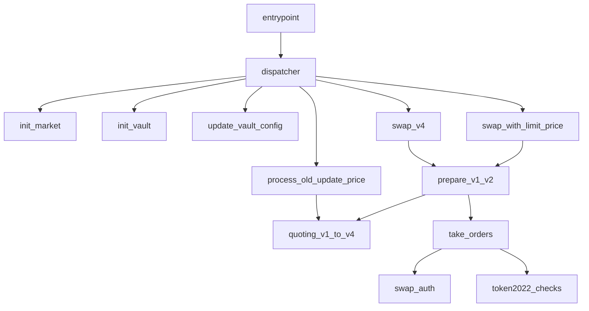

# 20260414-PropAMM合约收集报告

太子瑞

## 1. 简要说明

这周主要按实验卡要求，把 `HumidiFi`、`GoonFi` 和 `ZeroFi` 三个 PropAMM 程序的源码扒了一下。因为都没开源，也没有公开的 IDL，只能用个脚本（`scripts/fetch_propamm_programs.py`），通过 RPC 直接把升级版 `ProgramData` 里的原始字节码下载下来，去掉了 loader 头还原成 ELF 文件。

整体思路是：用 `file`、`readelf` 和 `strings` 跑静态分析，提取能看到的 Rust 模块名和符号，再结合这几个合约最近在链上的真实调用（账户数量、输入长度），推测了一版它们的核心函数和参数结构。重点梳理了和定价、报价相关的路径。

## 2. 合约及字节码存档

抓下来的二进制和元数据都在 `contracts/` 目录下：

| 项目       | Program ID                                     | ProgramData                                    | 字节码路径                           | 元数据             |
| -------- | ---------------------------------------------- | ---------------------------------------------- | ------------------------------- | --------------- |
| HumidiFi | `9H6tua7jkLhdm3w8BvgpTn5LZNU7g4ZynDmCiNN3q6Rp` | `G9S64i58RRWJA28vZiNhnP56Ux4Ef7hfMgHNREnZZSom` | `contracts/humidifi/program.so` | `metadata.json` |
| GoonFi   | `goonERTdGsjnkZqWuVjs73BZ3Pb9qoCUdBUL17BnS5j`  | `2yhK81gpQoK2jGKrokGYgt7TLt1yT3DM1DSWkpCHpnML` | `contracts/goonfi/program.so`   | `metadata.json` |
| ZeroFi   | `ZERor4xhbUycZ6gb9ntrhqscUcZmAbQDjEAtCf4hbZY`  | `6PFxy3S1LF9juamK4y6bcf3AEdJ47CF9zQV3DbdtMgBm` | `contracts/zerofi/program.so`   | `metadata.json` |

注：三者全是 `ELF 64-bit` (stripped) 的 BPF 程序，没有符号表，只能靠强扫。

---

## 3. 逆向分析结果

### 3.1 HumidiFi

**静态线索与输入特征：**
二进制里基本被扒干净了，只有 `entrypoint` 和 `custom_panic` 两个导出符号。但字符串里漏了一些关键源码路径：`contract/src/routers/jupiter.rs`、`dflow.rs`，以及 `stateupdate.rs` 和 `poolv1`。
链上最常见的交易模式很有意思：极简的 3 个账户（`signer/keeper`、`state`、`SysvarClock`），带 65 字节的 input（基本确定是 `1 字节 tag + 8 个 u64`）。

**推测的函数与参数：**

- `instructions/ops` (分发路由)：接加入口账户和指令。
- `state_update(...)`：更新状态用。吃 3 个账户，外加 65 字节数据。
- `router_jupiter(...)` / `router_dflow(...)`：对接外部聚合器的路由处理，输入包含报价或成交参数。
- `poolv1(...)`：底层池子逻辑，算库存和定价。

**和定价强相关的函数：**
主要是 `state_update`、`poolv1`，以及对外报单的 `router_jupiter` / `router_dflow`。

**调用链路：**

---

### 3.2 GoonFi

**静态线索与输入特征：**
剥得也很干净。扫出了几个有意思的路径：`blacklist_trader.rs`、`state/market.rs`。  
链上调用的方法比 HumidiFi 多：

- 建仓/初始化类：4 账户，34 字节数据。
- 主交易类（Swap/Settle）：8 账户（里面有两次 Token 转移），17 字节数据（1 字节 tag + 2 个 8 字节参数）。
- 清理类：6 账户，单字节 tag，主要是做 `CloseAccount`。

**推测的函数与参数：**

- `blacklist_trader(...)`：传 trader 和 market 账户，做黑名单控制。
- `market_state(...)`：操作 market 状态账户。
- `vault_update_or_init(...)`：初始化或更新金库，传 34 字节配置。
- `swap_or_settle(...)`：核心交易函数。要传 trader、两个 vault 和对应的 token 账户，带 17 字节参数。
- `close_temp_accounts(...)`：用完即焚的账户清理。

**和定价强相关的函数：**
`market_state`（可能包含价格预言机或内部参数）、`vault_update_or_init`、`swap_or_settle`（实际成交价格计算）。

**调用链路：**

---

### 3.3 ZeroFi

**静态线索与输入特征：**
ZeroFi 留下的线索最多，甚至很多 Instruction 名称直接以明文打在里面了（比如 `swap_v4`, `swap_with_limit_price`, `process_old_update_price`）。还有完整的 quoting（报价）模块路径：`quoting_v1` 到 `quoting_v4`。
最近它的高频操作是只有 2 个账户、104 字节数据的轻量级调用，这和它源码里暴露的 `process_old_update_price`（高频刷价格）完全吻合。

**推测的函数与参数：**

- `init_vault` / `init_market`：传配置和状态账户初始化。
- `update_vault_config(...)`：更新参数。
- `deposit` / `withdraw` / `deposit_v2` / `withdraw_v2`：出入金。
- `swap` / `swap_v4` / `swap_with_limit_price`：核心兑换，带限价参数。
- `process_old_update_price(...)`：**这个是重点**，只要 2 个账户，吃 104 字节数据（大概 13 个 8 字节参数），极低 CU，专用来刷报价。
- `take_orders(...)` / `prepare_v1_v2(...)`：订单簿处理和盘口准备。
- `quoting_v1` ~ `v4`：不同版本的核心定价算法，里面会处理 spread（点差）和 skew（倾斜）参数。

**和定价强相关的函数：**
`process_old_update_price`、`swap_with_limit_price`、`quoting_v1` 到 `quoting_v4`、`prepare_v1_v2`。

**调用链路：**

## 4. 小结

目前三个目标的二进制和分析脚本都已经归档了。

整体看下来，HumidiFi 和 GoonFi 脱壳后非常干净，基本得靠反推；但 ZeroFi 裸奔得比较厉害，直接暴露了 `quoting_v1_to_v4` 和 `process_old_update_price` 这种明牌定价链路。如果要继续往后深挖推导闭源定价算法，建议从 ZeroFi 做起，其104 字节的高频价格更新数据最容易做链上特征对齐。