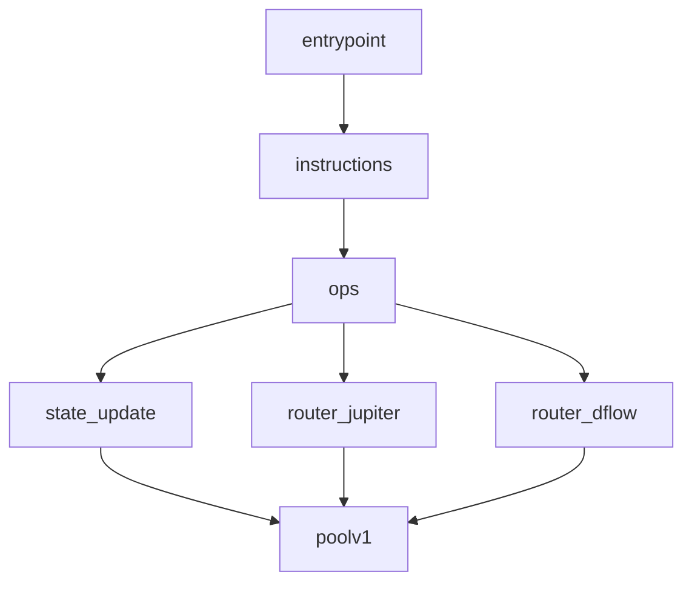
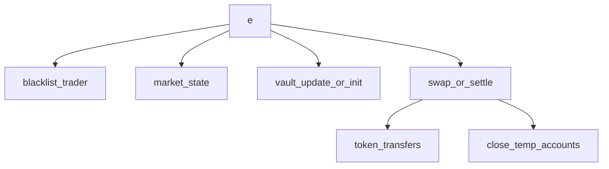
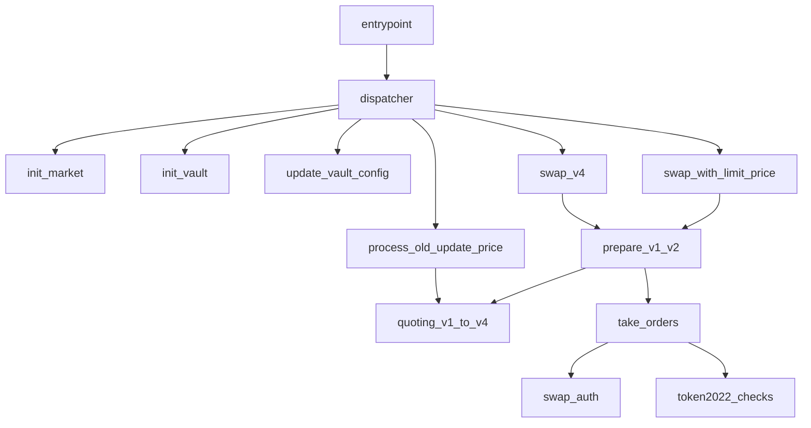

# 20260414-PropAMM合约收集报告

太子瑞

## 1. 说明

本报告覆盖实验卡本阶段要求：`HumidiFi`、`GoonFi`、`ZeroFi` 三个 `PropAMM` 程序的合约收集、字节码提取、函数信息提取与定价相关路径整理。

分析方法：

- 使用 `.env` 中的 `RPC_URL` 调用 `getAccountInfo`、`getSignaturesForAddress`、`getTransaction`。
- 从升级版 `ProgramData` 账户中提取原始字节码，并去掉 `45` 字节 loader 头得到 `ELF`。
- 对 `ELF` 运行 `file`、`readelf`、`strings`，再结合最近链上直接调用的账户输入与 `data` 长度，对函数和参数进行静态推断。

配套脚本：`[/home/ubuntu/blockchain/scripts/fetch_propamm_programs.py](/home/ubuntu/blockchain/scripts/fetch_propamm_programs.py)`

## 2. 合约列表及字节码文件

| 项目       | Program ID                                     | ProgramData                                    | 字节码文件                                                                                                                                                                      | 元数据                                                                         |
| -------- | ---------------------------------------------- | ---------------------------------------------- | -------------------------------------------------------------------------------------------------------------------------------------------------------------------------- | --------------------------------------------------------------------------- |
| HumidiFi | `9H6tua7jkLhdm3w8BvgpTn5LZNU7g4ZynDmCiNN3q6Rp` | `G9S64i58RRWJA28vZiNhnP56Ux4Ef7hfMgHNREnZZSom` | `[contracts/humidifi/program.so](/home/ubuntu/blockchain/contracts/humidifi/program.so)` / `[programdata.bin](/home/ubuntu/blockchain/contracts/humidifi/programdata.bin)` | `[metadata.json](/home/ubuntu/blockchain/contracts/humidifi/metadata.json)` |
| GoonFi   | `goonERTdGsjnkZqWuVjs73BZ3Pb9qoCUdBUL17BnS5j`  | `2yhK81gpQoK2jGKrokGYgt7TLt1yT3DM1DSWkpCHpnML` | `[contracts/goonfi/program.so](/home/ubuntu/blockchain/contracts/goonfi/program.so)` / `[programdata.bin](/home/ubuntu/blockchain/contracts/goonfi/programdata.bin)`       | `[metadata.json](/home/ubuntu/blockchain/contracts/goonfi/metadata.json)`   |
| ZeroFi   | `ZERor4xhbUycZ6gb9ntrhqscUcZmAbQDjEAtCf4hbZY`  | `6PFxy3S1LF9juamK4y6bcf3AEdJ47CF9zQV3DbdtMgBm` | `[contracts/zerofi/program.so](/home/ubuntu/blockchain/contracts/zerofi/program.so)` / `[programdata.bin](/home/ubuntu/blockchain/contracts/zerofi/programdata.bin)`       | `[metadata.json](/home/ubuntu/blockchain/contracts/zerofi/metadata.json)`   |

三者均为 `ELF 64-bit`、`stripped`、`BPF upgradeable loader` 程序，无公开源码校验和无公开 `IDL`。

## 3. 合约输入、函数列表与参数列表

### 3.1 HumidiFi

已确认的静态线索：

- 动态导出符号：`entrypoint`、`custom_panic`
- 字符串线索：`contract/src/instructions.rs`、`contract/src/ops.rs`、`contract/src/routers/dflow.rs`、`contract/src/routers/jupiter.rs`、`contract/src/stateupdate.rs`、`poolv1`

合约输入：

- 最近主导调用模式为 `3` 个账户、`65` 字节输入
- 样本账户：`[update_signer_or_keeper, market_or_pool_state, SysvarClock]`
- 参数布局推断：`1-byte tag + 8 x 8-byte fields`

函数列表及参数列表：

- `entrypoint()`
  - 参数：标准 Solana 程序入口参数
- `instructions/ops` 分发层
  - 参数：入口账户数组 + 指令字节流
- `state_update(...)`，推断来自 `contract/src/stateupdate.rs`
  - 账户参数：更新签名者、状态账户、`SysvarClock`
  - 数据参数：`1-byte opcode + 8 x 64-bit fields`
- `router_jupiter(...)`，推断来自 `contract/src/routers/jupiter.rs`
  - 账户参数：路由相关池子/状态账户
  - 数据参数：报价或成交相关 packed bytes
- `router_dflow(...)`，推断来自 `contract/src/routers/dflow.rs`
  - 账户参数：DFlow 路由相关账户
  - 数据参数：报价或成交相关 packed bytes
- `poolv1(...)`
  - 参数：池子状态和定价/库存相关数值

与定价相关的函数：

- `state_update`
- `poolv1`
- `router_jupiter`
- `router_dflow`

函数调用关系图：

### 3.2 GoonFi

已确认的静态线索：

- 动态导出符号：`e`、`custom_panic`
- 字符串线索：`program/src/instructions/blacklist_trader.rs`、`program/src/state/market.rs`、`vault`

合约输入：

- 观察到 3 类直接调用模式：
  - `4` 账户、`34` 字节输入，样本账户包含 `SystemProgram` 与 `SysvarRent`
  - `8` 账户、`17` 字节输入，参数布局为 `1-byte tag + 2 x 8-byte fields`
  - `6` 账户、`1` 字节输入，单字节 tag
- `8` 账户样本中出现双 `Token::Transfer` 内部调用；`6` 账户样本中出现双 `Token::CloseAccount`

函数列表及参数列表：

- `e()`，主入口
  - 参数：标准 Solana 程序入口参数
- `blacklist_trader(...)`
  - 账户参数：trader / market / authority 类账户
  - 数据参数：黑名单指令 packed bytes
- `market_state(...)`
  - 账户参数：market 状态账户
  - 数据参数：市场配置或状态 packed bytes
- `vault_update_or_init(...)`
  - 账户参数：payer、vault、`SystemProgram`、`SysvarRent`
  - 数据参数：`34` 字节 packed bytes
- `swap_or_settle(...)`
  - 账户参数：trader、base vault、quote vault、用户 token 账户、`Token Program`、`System Program`
  - 数据参数：`1-byte tag + 2 x 8-byte fields`
- `close_temp_accounts(...)`
  - 账户参数：临时 token 账户、owner、`Token Program`
  - 数据参数：`1-byte tag`

与定价相关的函数：

- `market_state`
- `vault_update_or_init`
- `swap_or_settle`

函数调用关系图：

### 3.3 ZeroFi

已确认的静态线索：

- 动态导出符号：`entrypoint`、`custom_panic`
- 二进制中直接出现了多条指令字符串与模块名：
  - `Instruction: update_vault_config`
  - `Instruction: swap`
  - `Instruction: swap_v4`
  - `Instruction: init_vault`
  - `Instruction: init_market`
  - `Instruction: withdraw`
  - `Instruction: deposit`
  - `Instruction: create_or_set_init_settings`
  - `Instruction: swap_with_limit_price`
  - `Instruction: deposit_v2`
  - `Instruction: withdraw_v2`
  - `programs/amm/src/dispatcher.rs`
  - `programs/amm/src/process_swap.rs`
  - `programs/amm/src/process_old_update_price.rs`
  - `programs/amm/src/prepare_v1.rs`
  - `programs/amm/src/prepare_v2.rs`
  - `programs/amm/src/take_orders.rs`
  - `programs/amm/src/swap_auth.rs`
  - `programs/amm/src/classify_counterparty.rs`
  - `lib/quoting/src/quoting_v1.rs` 到 `quoting_v4.rs`

合约输入：

- 最近主导调用模式为 `2` 个账户、`104` 字节输入
- 样本账户：`[updater_or_keeper, market_price_or_config_account]`
- 参数布局推断：`13 x 8-byte fields`
- 该类交易仅消耗极低 `CU`，与 `process_old_update_price` / quoting 更新路径一致

函数列表及参数列表：

- `entrypoint()`
  - 参数：标准 Solana 程序入口参数
- `dispatcher(...)`
  - 参数：指令 tag、账户数组、原始输入数据
- `init_vault(...)`
  - 参数：vault 账户、配置参数
- `init_market(...)`
  - 参数：market 账户、市场配置参数
- `create_or_set_init_settings(...)`
  - 参数：初始化配置账户、配置 packed bytes
- `update_vault_config(...)`
  - 参数：vault/config 账户 + packed config fields
- `deposit(...)` / `deposit_v2(...)`
  - 参数：用户资金账户、vault、金额参数
- `withdraw(...)` / `withdraw_v2(...)`
  - 参数：用户资金账户、vault、金额参数
- `swap(...)` / `swap_v4(...)` / `swap_with_limit_price(...)`
  - 参数：市场/报价账户、用户 token 账户、限价/数量 packed fields
- `process_old_update_price(...)`
  - 参数：更新者、price account、`104` 字节定价字段
- `prepare_v1(...)` / `prepare_v2(...)`
  - 参数：报价版本与市场上下文
- `take_orders(...)`
  - 参数：订单层、对手方分类、成交数量
- `swap_auth(...)` / `token2022_checks(...)`
  - 参数：权限校验与 token 约束
- `quoting_v1(...)` / `quoting_v2(...)` / `quoting_v3(...)` / `quoting_v4(...)`
  - 参数：price account、spread modifier、expiry/skew 等定价字段

与定价相关的函数：

- `process_old_update_price`
- `update_vault_config`
- `swap_with_limit_price`
- `quoting_v1` 到 `quoting_v4`
- `prepare_v1` / `prepare_v2`

函数调用关系图：

## 4. 结论

- 三个目标程序均已完成合约地址确认、`ProgramData` 定位与字节码导出。
- `HumidiFi` 与 `GoonFi` 的二进制符号更少，函数名称以模块名和链上输入模式推断为主。
- `ZeroFi` 二进制中保留了较多内部模块与指令字符串，因此函数列表最完整，尤其是 `swap_v4`、`swap_with_limit_price`、`process_old_update_price`、`quoting_v1-v4` 等定价链路已能直接定位。
- 报告要求中的五项内容均已覆盖：合约列表及字节码文件、合约输入、函数列表及参数列表、与定价相关的函数、函数调用关系图。

