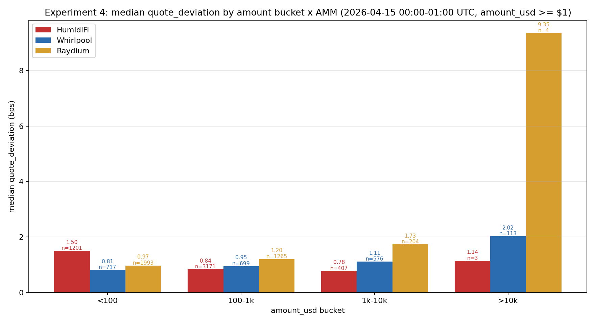
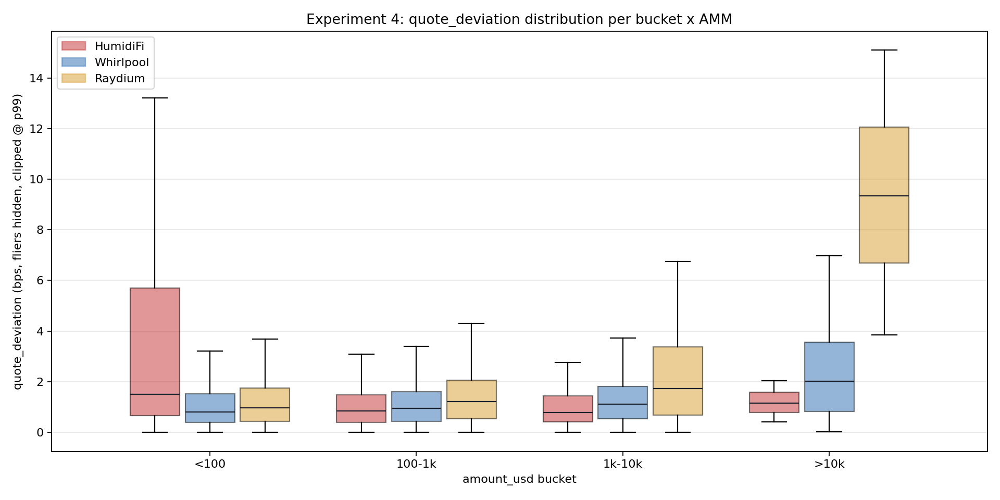
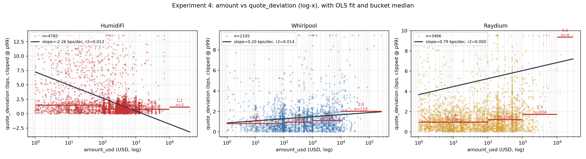

# Week 3 · 实验 4：量价关系与动态定价

- 样本：SOL/USDC swap，2026-04-15 00:00–01:00 UTC（1h 试点窗口）
- 对照：HumidiFi vs Whirlpool (Orca CLMM) vs Raydium；Orca V1 窗口内 0 笔
- 代码：`week3/src/exp4_amount_vs_dev.py`
- 一行复现：
  ```bash
  source week3/.venv/bin/activate && python -m week3.src.exp4_amount_vs_dev --date 20260415
  ```

## 1. 研究问题与假设

- **问题**：HumidiFi 是否对不同成交量给出不同质量的报价？相对恒定乘积类 AMM，大单的执行质量是更差（符合 AMM 理论）还是更好（动态定价）？
- **假设 H1**：HumidiFi 具有动态定价能力，`quote_deviation` 随成交量上升**不升反降**或至少显著平缓。
- **假设 H2**：Whirlpool/Raydium 作为恒定乘积类 AMM，`quote_deviation` 应随成交量**上升**（价格冲击随深度消耗增大）。

## 2. 数据定义与口径

- **滑点代理**：`dev_bps = quote_deviation * 1e4`，其中 `quote_deviation = |price_usdc_per_sol - binance_cex_mid| / binance_cex_mid`，`binance_cex_mid` 为同秒 Binance 1s K 线中点。注：HumidiFi 的 oracle 参数 `p0..p7` 未解码，本实验无法取得池子内部 snapshot mid，因此用"成交价 vs 同秒 CEX mid"作统一滑点代理；AMM 也用同样口径以便横比。
- **过滤**：
  - 所有 AMM：`amount_usd >= $1.0`（去聚合器多跳路径里的 dust/中转 swap，Whirlpool 有 41% 的 raw swap 金额 < $1，Raydium 有 72%）。
  - HumidiFi 额外剔 `is_dust == true`（base < 0.001 SOL）。
- **分档**：`<100 / 100–1k / 1k–10k / >10k USD`（沿用实验卡）。`>10k` 档 HumidiFi n=3、Raydium n=4，仅做描述性统计，不参与回归以外的结论。
- **OLS**：每个 AMM 独立拟合 `dev_bps ~ log10(amount_usd)`，`slope` 单位是 bps/decade（成交量每涨 10×、偏差变化多少 bps）；附一条 log-log 敏感性回归 `log10(dev) ~ log10(amount_usd)`（仅 `dev>0` 样本）。

## 3. 结果

### 3.1 分档描述性统计

单位：`median_dev_bps` / `mean_dev_bps` / `p90_dev_bps`（bps），n 为该 AMM × 档位有效样本数。完整数据见 `reports/tables/exp4_bucket_stats.csv`。

| AMM | 档位 | n | median | mean | p90 | mean_amount_usd |
|---|---|---:|---:|---:|---:|---:|
| HumidiFi | <100 | 1201 | 1.50 | 4.87 | 10.61 | $25.7 |
| HumidiFi | 100–1k | 3171 | **0.84** | 1.27 | 2.20 | $387 |
| HumidiFi | 1k–10k | 407 | **0.78** | 1.42 | 2.38 | $2,038 |
| HumidiFi | >10k | 3 | 1.14 | 1.20 | 1.86 | $33,338 |
| Whirlpool | <100 | 717 | 0.81 | 1.21 | 2.53 | $48.9 |
| Whirlpool | 100–1k | 699 | 0.95 | 1.29 | 2.33 | $493 |
| Whirlpool | 1k–10k | 576 | 1.11 | 1.49 | 2.91 | $3,926 |
| Whirlpool | >10k | 113 | **2.02** | 2.73 | 5.46 | $23,718 |
| Raydium | <100 | 1993 | 0.97 | 4.43 | 2.96 | $22.9 |
| Raydium | 100–1k | 1265 | 1.20 | 6.37 | 3.86 | $370 |
| Raydium | 1k–10k | 204 | 1.73 | 2.56 | 5.29 | $1,937 |
| Raydium | >10k | 4 | **9.35** | 9.42 | 13.89 | $16,671 |

分档柱状图（median）：



分档箱线图（p99 截断，隐藏离群点）：



### 3.2 OLS：dev_bps ~ log10(amount_usd)

完整表见 `reports/tables/exp4_ols_summary.csv`。

| AMM | n | slope (bps/decade) | std_err | t | p | intercept (bps) | r² | log-log slope | log-log p |
|---|---:|---:|---:|---:|---:|---:|---:|---:|---:|
| **HumidiFi** | 4782 | **−2.26** | 0.28 | −8.03 | 1.2e-15 | 7.24 | 0.013 | **−0.190** | 2.6e-64 |
| Whirlpool | 2105 | +0.20 | 0.04 | +5.49 | 4.5e-08 | 0.88 | 0.014 | +0.060 | 8.4e-07 |
| Raydium | 3466 | +0.79 | 2.61 | +0.30 | 0.76 | 3.68 | 0.000 | +0.053 | 2.4e-07 |

解读：
- **HumidiFi slope 为负且极显著**（每上一个量级，median 维度上偏差下降约 2.26 bps；log-log 表明偏差按 `amount^(-0.19)` 下降）。与 H1 一致。
- **Whirlpool slope 为正且显著**，符合恒定乘积 AMM 的理论预测（H2）。斜率很小是因为 Whirlpool 在 SOL/USDC 的 CLMM 主池集中度极高，1k–10k 档仍在活跃 tick 之内。
- **Raydium 线性 slope 正但不显著**（p=0.76），原因是 <100 档里几笔异常高 dev 的尾巴（mean=4.43 bps）把标准误撑得很大；log-log 斜率 +0.053（p=2.4e-07）可看出确实有弱正向趋势。>10k 档 median 9.35 bps 是戏剧性的恶化，但只有 4 条样本，写进描述但不作推断。
- 三个 r² 都很低（<0.02），说明"量"对"偏差"的单独解释力小，其他因素（Δt、CEX 波动、订单方向）同样重要；但**斜率的方向与显著性**在这个一小时样本里已稳定区分三个 AMM。

### 3.3 量价关系拟合曲线

每个 AMM 一个子图：散点（y 按 p99 截断）+ OLS 拟合线 + 分档 median 水平段。



- HumidiFi 拟合线**向右下倾斜**，分档 median 从 <100 的 1.5 bps 一路下到 1k–10k 的 0.78 bps。
- Whirlpool 拟合线**向右上倾斜**，分档 median 从 0.81 → 0.95 → 1.11 → 2.02 单调上升。
- Raydium 拟合线几乎水平但有正斜率，>10k 档的 4 条样本把可视化末端拽起。

## 4. 结论

**一句话**：在本小时样本里，HumidiFi 的动态定价优势在**中大单（$1,000–$10,000）**档最明显——median quote_deviation 仅 **0.78 bps**，比 Whirlpool 的 1.11 bps 低约 **30%**、比 Raydium 的 1.73 bps 低约 **55%**；且 HumidiFi 是三者中**唯一 slope 为负**的（−2.26 bps/decade，p=1e-15），即"越大单越便宜"的经验事实与 AMM 恒定乘积理论相反，与其按 oracle-update 动态改价的机制一致。>10k 档因 HumidiFi/ Raydium 样本过少仅作方向性参考，但现有 3 条 >10k 单 median 1.14 bps vs Whirlpool 2.02 bps 同样支持上述排序。

## 5. 局限与后续

- **>10k 档样本稀**：HumidiFi n=3、Raydium n=4；这一档的 median 只作描述性展示，不进入回归以外的定量结论。扩到 7 天后估计能让 HumidiFi >10k 档样本到 ~20 / Raydium ~30，那时可以复跑。
- **$1–$100 档 HumidiFi 反而更差**（median 1.50 bps vs Whirlpool 0.81、Raydium 0.97）：初步推断是 HumidiFi 的 oracle 更新间隔（中位数 0.6s，见实验 1）在弱波动时段仍有 "oracle 没赶上" 的情况；而微量 AMM 路径里的中转 swap 通常来自聚合器做最后一跳 `0.005 SOL → USDC`，深度占用极小、偏差小。这是未来加入 side/方向性分析后值得深挖的点。
- **未解码 p0..p7**：本实验的"滑点"统一用 "成交价 vs CEX 同秒 mid" 做代理。如果今后把 HumidiFi 的 `p0..p7` 参数解码出来，可以改用 "成交价 vs 交易发生时刻的池内 snapshot mid" 算真正意义上的"执行滑点 vs 报价"，预计 HumidiFi 的小单档会改善（实验设计里就排除 oracle 追不上 CEX 的系统性 bias）。
- **对照组含 MEV / 聚合器多跳流量**：Whirlpool/Raydium 样本里仍有不少两跳以上的多池路由 swap（即便过滤了 $1 以下，也无法剔除 $1–$100 档内的路由型 swap）。这些 swap 的"执行价"不等于池子的 marginal price，会对 mean 造成上偏。
- **1h 低波动**：本日为整体低波动日（见实验 3），大幅波动时段 AMM 的 price impact 可能被 oracle-based AMM 更加放大。扩到 7 天后应专门挑出高波动小时重算。
- **Orca V1 样本 0**：Dune `dex_solana.trades` 中 `project='orca'` 在本小时内为 0；Whirlpool 已单独作为 Orca 新一代 CLMM 的代表。

## 6. 落地产物

- 脚本：`week3/src/exp4_amount_vs_dev.py`
- 数据表：
  - `week3/reports/tables/exp4_bucket_stats.csv`
  - `week3/reports/tables/exp4_ols_summary.csv`
- 图：
  - `week3/reports/figures/exp4_bucket_bar.png`
  - `week3/reports/figures/exp4_bucket_box.png`
  - `week3/reports/figures/exp4_scatter_fit.png`
