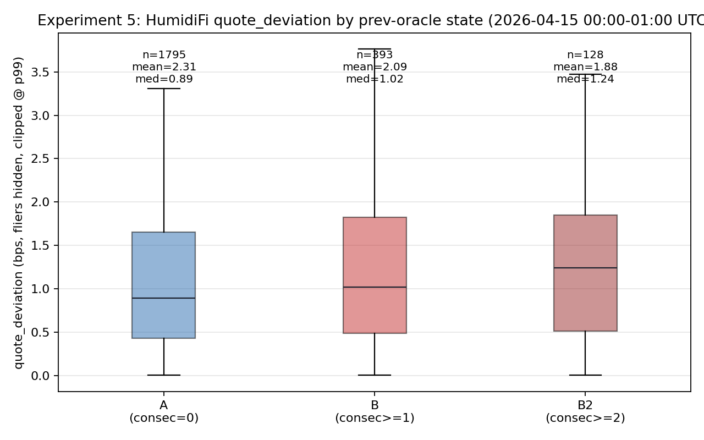
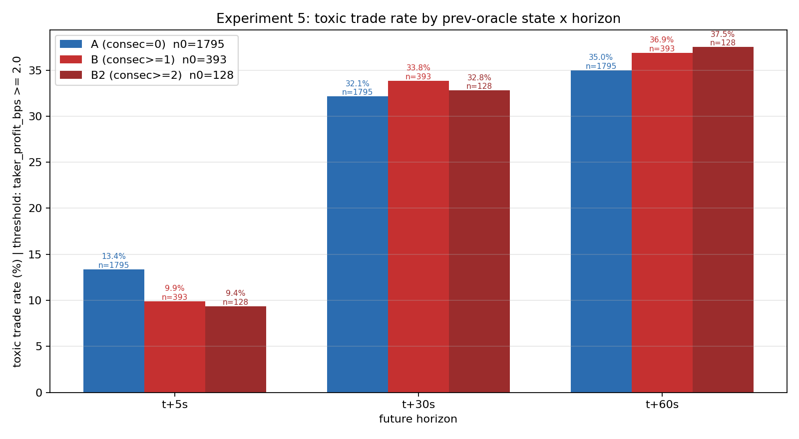
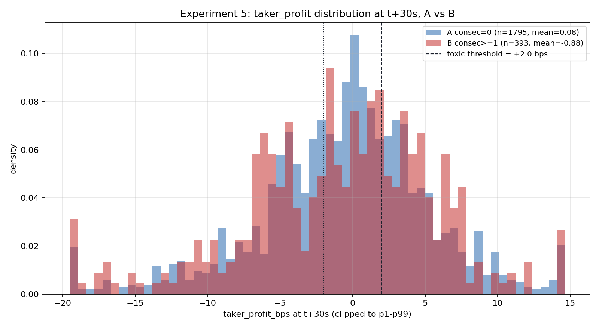

# Week 3 · 实验 5：Revert 与逆向选择

- 样本：HumidiFi SOL/USDC swap，2026-04-15 00:00–01:00 UTC（1h pilot）
- 代码：`week3/src/exp5_revert_toxicity.py`
- 一行复现：
  ```bash
  source week3/.venv/bin/activate && python -m week3.src.exp5_revert_toxicity --date 20260415
  ```

## 1. 研究问题与假设

- **问题**：当 HumidiFi 最近一次 oracle update 失败（revert），下一笔 swap 在执行时拿到的是"陈旧报价"，此时成交是否更可能是套利者（informed / 有毒订单）？
- **假设 H1（实验卡原文）**：B 组（前序 oracle revert）的 swap 相较 A 组（前序 success）：
  - (a) `quote_deviation` 更大（偏离 CEX mid 更多）
  - (b) 有毒订单占比更高（成交后 CEX 价继续朝 taker 有利方向动）
  - (c) 池子因此承担显著的逆向选择损失

## 2. 数据定义与口径

### 2.1 分组（per state_account 精确计数）

对每笔 HumidiFi swap（slot = `S_swap`，池 = `state_account`），扫描该池的 `oracle_updates` 序列，统计"上一次 SUCCESS 到当前 swap 之间累计了多少次 revert"：

- **A 组**（`consec_reverts == 0`）：最近一次 oracle 事件是 success。
- **B 组**（`consec_reverts >= 1`）：自上次 success 以来至少累计 1 次 revert。
- **B2 子集**（`consec_reverts >= 2`）：连续 2 次及以上 revert。
- **C 组**（`no prior oracle`）：swap 发生在该池第一条 oracle 之前，或该池无 oracle 记录 → 排除出 A/B 对比。

> 注：实验卡里的朴素写法 `prev_oracle_time != prev_oracle_success_time` 在本数据集下几乎抓不到 B 组，因为 `block_time` 是 1s 粒度，HumidiFi 经常在同一秒里 `revert → success` 连发，按时间比较会把它们算作同秒"最近是 success"。本实验改用 **slot 级（400 ms）per-pool 累计计数** 做分组，更准确捕捉"当前报价陈旧"的情形。

### 2.2 有毒订单 & 事后价格变动

- 对每笔 swap，取 Binance 1s K 线在 `floor(block_time) + Δ` 秒（Δ ∈ {5, 30, 60}）的 `close` 作 `mid_Δ`。
- 定义 taker 方向性利润：
  - `buy_sol`: `taker_profit_bps = (mid_Δ − p_s) / p_s × 1e4`
  - `sell_sol`: `taker_profit_bps = (p_s − mid_Δ) / p_s × 1e4`
- **有毒交易**：`taker_profit_bps ≥ 2 bps`（主口径 t+30s；副口径 t+5s / t+60s）。2 bps 阈值旨在过滤 Binance 1s 中间价 ~1 bps 的随机噪声。

### 2.3 Revert 损失两口径

1. **朴素口径（实验卡原文）**：`mean(dev_bps_B)/1e4 × sum(amount_usd_B)`。物理含义是 "B 组平均偏差作为单位损失率，乘以 B 组总成交量"，上限式估计。
2. **稳健口径（taker-profit 版）**：`Σ_B max(0, taker_profit_bps_30s)/1e4 × amount_usd`。含义是 "只把事后对 taker 有利的那部分剥离出来（informed-rent），按成交额加权求和"。同时给出相较 A 组 baseline 正规化后的增量损失。

## 3. 结果

### 3.1 样本量与描述性统计

过滤 HumidiFi 非 dust、`amount_usd ≥ $1`：共 **5,528** 笔，其中能匹配到前序 oracle 的 **2,188** 笔（A+B），另有 3,340 笔无前序 oracle（排除）。完整表见 `reports/tables/exp5_group_summary.csv`。

| 组 | n | mean amount_usd | mean dev_bps | median dev_bps | mean profit_t30 (bps) | toxic_rate_t30 |
|---|---:|---:|---:|---:|---:|---:|
| **A** (consec=0) | 1,795 | $459 | 2.31 | 0.89 | +0.08 | **32.1%** |
| **B** (consec≥1) | 393 | $390 | 2.09 | 1.02 | −0.88 | **33.8%** |
| **B2** (consec≥2) | 128 | $476 | 1.88 | 1.24 | −0.73 | 32.8% |
| C (no prior) | 3,340 | $520 | 1.89 | 0.90 | −0.67 | 29.2% |

- B 组 mean `dev_bps` 反而比 A 低 0.22 bps，但 median 高 0.13 bps——分布主体略右移，但尾部更短。
- B 组 mean taker profit 在 t+30s 是 **−0.88 bps**（对 taker 不利），A 组是 **+0.08 bps**（中性）。**与 H1 (b) 相反**。
- 毒性率 B 比 A 高 1.7 pp（33.8% vs 32.1%），方向与 H1 一致，但幅度很小。

### 3.2 Welch t 检验（A vs B，t+30s 主口径）

完整表见 `reports/tables/exp5_ttest.csv`。

| 检验 | 指标 | g1 (n) | g2 (n) | g1 mean | g2 mean | diff | t | p |
|---|---|---|---|---:|---:|---:|---:|---:|
| A vs B | dev_bps | A (1,795) | B (393) | 2.31 | 2.09 | −0.22 | 0.38 | **0.70** |
| A vs B2 | dev_bps | A (1,795) | B2 (128) | 2.31 | 1.88 | −0.43 | 0.73 | **0.46** |
| A vs B | taker_profit_bps_30s | A (1,795) | B (393) | +0.08 | −0.88 | −0.96 | 1.37 | **0.17** |
| A vs B2 | taker_profit_bps_30s | A (1,795) | B2 (128) | +0.08 | −0.73 | −0.81 | 0.97 | **0.33** |

**没有一个检验的 p 值低于 0.05**。假设 H1 在本样本内**未得到统计支持**。

### 3.3 图

A / B / B2 三组 `dev_bps` 分布非常接近，箱体位置几乎重叠（p99 截断后）：



三个时间窗 × 三组的毒性率柱图：B 组在所有 Δ 上都比 A 略高 1–2 pp，但样本内差异不显著；t+5s 档 B 组反而更低（9.9% vs A 的 13.4%）。



t+30s 的 `taker_profit_bps` 分布（clip 到 p1–p99 密度）：A 组略集中在 0 附近，B 组左尾更肥（taker 在成交后亏）。两条 `±2 bps` 虚线是有毒判定阈值。



### 3.4 损失估算

完整表见 `reports/tables/exp5_loss_estimate.csv`。

| 组 | n | sum amount_usd | 朴素损失 (USD) | 稳健损失 (USD) | 稳健损失率 (bps) | 相较 A 的增量损失 (USD) |
|---|---:|---:|---:|---:|---:|---:|
| A | 1,795 | $823,980 | $190.32 | $164.10 | 1.99 | — |
| B | 393 | $153,096 | $32.03 | $33.07 | 2.16 | **+$2.58** |
| B2 | 128 | $60,923 | $11.46 | $12.96 | 2.13 | +$0.82 |

- B 组稳健损失率仅比 A 高 **0.17 bps**；折算到 1h 内总增量损失仅 **~$2.58**（B 组）/ **~$0.82**（B2）。
- 即便相信 H1 的方向，在 2026-04-15 的这个 1h 窗口里，revert 导致的 incremental 逆向选择损失在**绝对量级上可以忽略**。

## 4. 结论

**一句话**：在本 1h 低波动样本（2026-04-15 00:00–01:00 UTC）里，HumidiFi 的 revert 与逆向选择**没有显现出实验卡预期的强信号**——B 组相较 A 组的报价偏差、毒性率、taker profit 差异均不显著（p ∈ [0.17, 0.70]），B 组相较 A 组的增量 informed-rent 仅 **~$2.6 / 1h**。可能的解释：HumidiFi 的 revert 多半来自**协议内部状态校验**（`Custom: 57005` 等 error，可见 `oracle_updates.err_code`），并非"我想抢先更新价格但被抢跑"这种会暴露 stale quote 的情形；在该时段里，revert 之后的"陈旧窗口"往往只有 1–2 slot（400–800 ms），且下一个 success 已经紧跟到达。

## 5. 局限与后续

- **1h 低波动样本**：本日 Binance SOL/USDC 在整小时内波动幅度 < 0.3%（实验 3 已报），套利者"开机率"低；真正毒流应该发生在高波动区段。扩到 7 天后，挑出 `max 5s |Δprice|/price > 0.3%` 的高波动小时复跑，B 组有效样本应显著增加。
- **2 bps 阈值接近 CEX 噪声**：Binance 1s K 线 mid 的自然噪声在 1–3 bps，2 bps 的 toxic 阈值几乎是边界值。未来可配合 Coinbase / Bybit 多源 mid 做稳健检查，或改用 `|profit| > 2σ` 的动态阈值。
- **无 AMM 背景基线**：本次只对比 HumidiFi 内部 A vs B。"HumidiFi 毒性率 32% ≈ Whirlpool/Raydium ?%" 这个问题仍未回答；要说明 HumidiFi 的 *整体* 毒流水平，需另外跑 Whirlpool/Raydium 的等口径 toxic_rate。
- **B2 样本稀**：连续 ≥2 次 revert 仅 128 条，不足以细分成交量分档。
- **套利者不一定在 CEX 平仓**：如果套利者在 Solana 上换一个 pool 反手（比如 HumidiFi → Orca），t+Δ 的 Binance mid 不能完整反映套利盈亏。后续可叠加"同一 trader 在 t+Δ 内是否跨池再交易"的行为分析。
- **revert 根因未分类**：目前 B 组没有按 `err_code` 细分；未来区分 "协议状态校验 revert" 与 "被抢跑 revert" 应当能让 H1 重新可检验。
- **朴素损失口径略偏高**：`mean(dev_bps) × sum(amount_usd)` 把所有偏差都归为损失，其实 deviation 里一半是对 taker 不利（对 pool 有利）。稳健口径只取 `taker_profit > 0` 的一半更贴近 "pool 真的被套" 的含义，两者在报告中同时给出。

## 6. 落地产物

- 脚本：`week3/src/exp5_revert_toxicity.py`
- 表：
  - `week3/reports/tables/exp5_group_summary.csv`
  - `week3/reports/tables/exp5_ttest.csv`
  - `week3/reports/tables/exp5_loss_estimate.csv`
- 图：
  - `week3/reports/figures/exp5_dev_box.png`
  - `week3/reports/figures/exp5_toxic_bar.png`
  - `week3/reports/figures/exp5_profit_hist.png`
